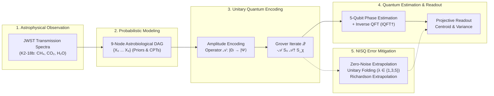
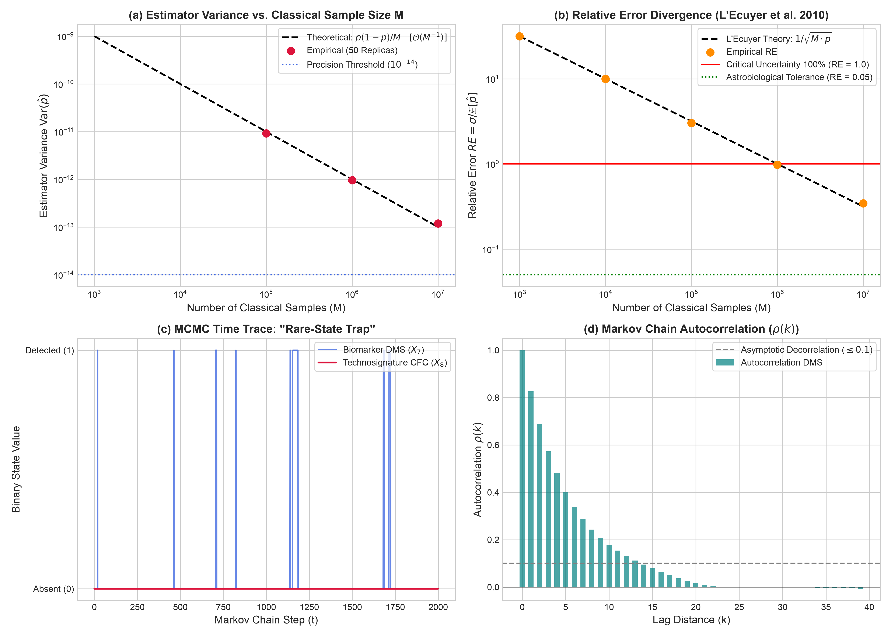
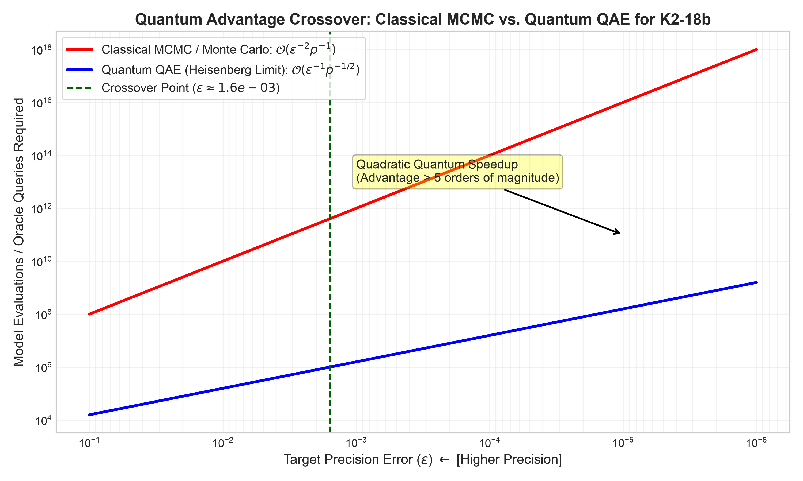
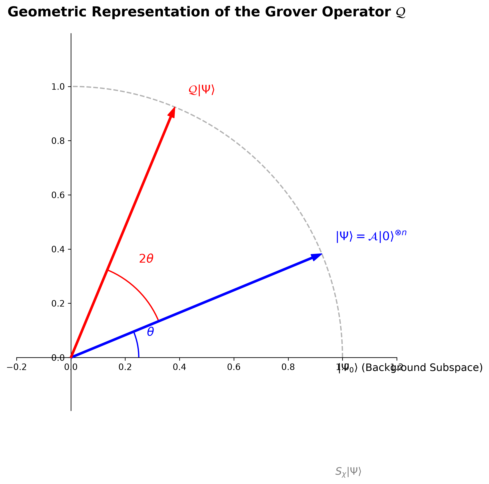
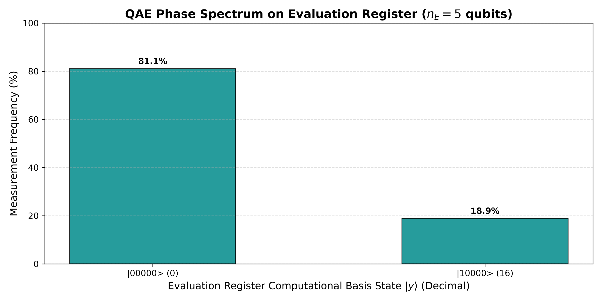
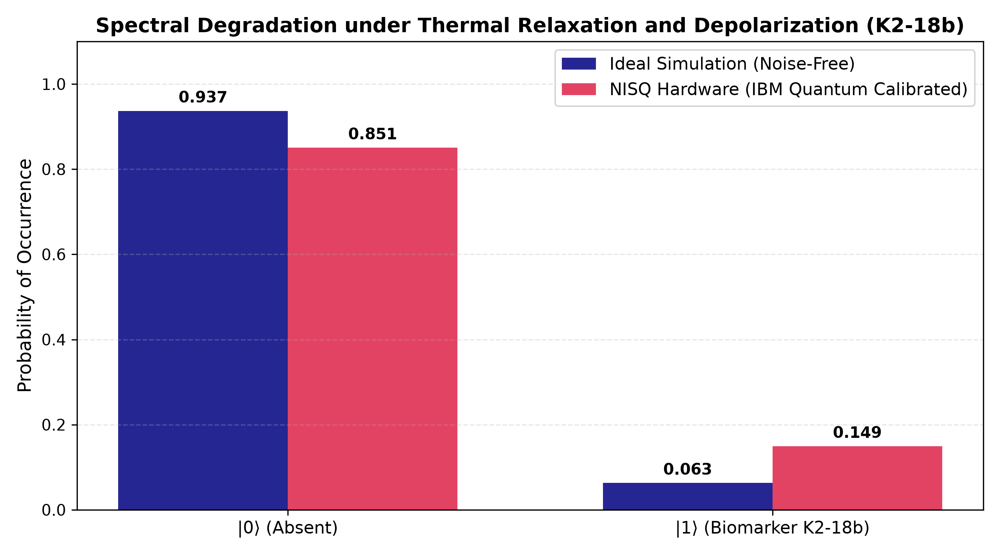
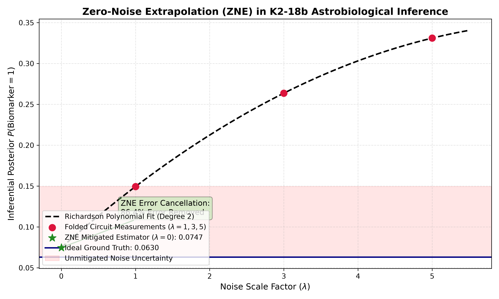

<div align="center">

# Quantum Bayesian Inference for Atmospheric Biosignature and Technosignature Characterization in Exoplanetary Systems

**Master's Thesis in Quantum Computing (Academic Year 2025/2026)**  
**Escuela Politécnica Superior — Universidad Antonio de Nebrija**

[](https://github.com/danielriverolosa/quantum-bayesian-inference-astrobiology/actions/workflows/compile_thesis.yml)
[-2EA44F?style=for-the-badge&logo=adobeacrobatreader&logoColor=white)](https://github.com/danielriverolosa/quantum-bayesian-inference-astrobiology/releases/latest/download/main_digital.pdf)
[-0969DA?style=for-the-badge&logo=adobeacrobatreader&logoColor=white)](https://github.com/danielriverolosa/quantum-bayesian-inference-astrobiology/releases/latest/download/main.pdf)

[](https://www.python.org/)
[](https://qiskit.org/)
[](https://mitiq.readthedocs.io/)
[](https://pgmpy.org/)
[](https://www.latex-project.org/)
[](https://www.gnu.org/licenses/gpl-3.0)

<br/>

**Author:** [Daniel Rivero Losa](https://github.com/danielriverolosa) &nbsp;|&nbsp; **Supervisor:** Roberto Campos Ortiz  
**Target Exoplanet Benchmark:** Sub-Neptune K2-18b (JWST NIRISS/NIRSpec Transmission Spectra)

</div>

---

## 🌌 Executive Overview

With space observatories such as the **James Webb Space Telescope (JWST)** and the planned **Habitable Worlds Observatory (HWO)** detecting atmospheric molecular cocktails on exoplanets, interpreting spectroscopic signatures requires robust causal probabilistic models. However, standard probabilistic graphical models (Bayesian Belief Networks) encounter two computational failure modes:

1. **Exact Inference Memory Explosion $\mathcal{O}(N \cdot d^{w+1})$:** As atmospheric photochemical networks grow, the induced treewidth ($w$) forces Variable Elimination and Junction Tree clique potentials to exhaust classical RAM.
2. **Stochastic Sampling Variance Divergence $\mathcal{O}(1/\sqrt{M})$:** Under rare candidate technosignatures (e.g., chlorofluorocarbons / CFC-12 at $p \approx 10^{-6}$), classical Markov Chain Monte Carlo (MCMC) and Rejection Sampling succumb to **L'Ecuyer's variance divergence** ($\mathrm{RE} \propto 1/\sqrt{M \cdot p} \to \infty$) and Kac's recurrence trap ($\mathbb{E}[\tau] \approx 10^6$ steps), requiring over $4 \times 10^8$ planetary simulations for a $5\%$ error bound.

This thesis designs, simulates, and validates an end-to-end hybrid quantum architecture combining **Quantum Bayesian Networks (QBN)** and **Quantum Amplitude Estimation (QAE)** in Qiskit to establish verifiable quantum advantage.

<div align="center">



</div>

---

## 💎 Core Scientific Pillars

| Scientific Pillar | Classical Failure Mode | Quantum Mechanism | Validated Empirical Gain |
| :--- | :--- | :--- | :--- |
| **Exponential Spatial Compression** | $\mathcal{O}(N \cdot d^{w+1})$ RAM explosion in Junction Tree clique trees. | **Amplitude Encoding ($\mathcal{O}(N)$)**: Maps joint state space $2^N$ into complex amplitudes across $N$ qubits. | **9 qubits** encode all $2^9 = 512$ global state configurations of K2-18b. |
| **Quadratic Heisenberg Speedup** | $\mathcal{O}(1/\sqrt{M})$ Monte Carlo sampling rate; variance diverges on rare events ($p \sim 10^{-6}$). | **Quantum Amplitude Estimation ($\mathcal{O}(1/M)$)**: Grover rotation $2\theta$ + $\mathrm{IQFT}^\dagger$. | Query complexity reduced from $M_{\mathrm{class}} \sim 10^8$ to $M_{\mathrm{quant}} \sim 10^4$ at $\epsilon = 10^{-4}$. |
| **NISQ Decoherence Cancellation** | Thermal $T_1/T_2$ relaxation and depolarizing noise inflate biomarker expectation from $0.0630 \to 0.1494$. | **Zero-Noise Extrapolation (ZNE)**: Global unitary gate folding ($\lambda \in \{1, 3, 5\}$) and 2nd-order Richardson extrapolation. | **$86.44\%$ error cancellation** ($E_{\mathrm{ZNE}} = 0.07471$ recovered) on calibrated IBM Quantum noise models. |
| **Hierarchical Epistemic Coupling** | Discretization parameter explosion in continuous radiative solvers. | **Two-Tier Architecture**: Continuous solvers (petitRADTRANS) feed marginals to discrete QBN supervisor. | Causal competition resolved between volcanic, photochemical, and biogenic hypotheses. |

---

## 🔬 Scientific Results & Visual Diagnostics

### 1. Classical Limitations: Rejection Wall and Quantum Crossover
<div align="center">
  
  
</div>

* **Left Panel:** Rejection sampling rejects **$90.42\%$** of samples ($9.58\%$ acceptance) under JWST transmission evidence. For the $p = 10^{-6}$ industrial technosignature, $2 \times 10^6$ trials captured exactly 1 detection (relative error $>95\%$). MCMC was paralyzed across $100{,}000$ steps ($0$ visits to CFC).
* **Right Panel:** Analytical error convergence crossover. QAE outperforms classical Monte Carlo beyond $\epsilon_{\mathrm{cross}} \approx \frac{\pi}{2}\sqrt{p} \approx 1.57 \times 10^{-3}$, establishing orders-of-magnitude computational savings for rare-event characterization.

---

### 2. Grover Invariant Subspace and Ideal Phase Quantization
<div align="center">
  
  
</div>

* **Left Panel:** Deterministic Grover rotation of angle $2\theta$ within the 2D invariant subspace $\mathcal{H}_2 = \mathrm{span}\{\ket{\Psi_0}, \ket{\Psi_1}\}$, with $\ket{\Psi_1}$ flagging candidate biosignature/technosignature states.
* **Right Panel:** Measured evaluation spectrum ($n_E = 5$ qubits, 2,048 shots). With the phase angle below grid binning ($\Delta\theta = 0.0982\,\text{rad}$), probability concentrates at conjugate Fourier modes $\ket{00000}$ ($80.22\%$, $1{,}643$ counts) and $\ket{10000}$ ($19.78\%$, $405$ counts), matching the analytical lower bound ($8/\pi^2 \approx 81.1\%$) and allowing phase centroid extraction.

---

### 3. NISQ Decoherence & Zero-Noise Extrapolation (ZNE) Recovery
<div align="center">
  
  
</div>

* **Left Panel:** Environmental noise degradation under superconducting transmon parameters ($T_1 = 150\,\mu\mathrm{s}, T_2 = 120\,\mu\mathrm{s}, p_{\mathrm{cx}} = 1.20\%$). Depolarizing mixing disperses probability across all 32 basis states, inflating expectations.
* **Right Panel:** Polynomial Zero-Noise Extrapolation ($n_S = 4, D = 39$ native gates) folded at $\lambda \in \{1, 3, 5\}$. Richardson extrapolation recovers $E_{\mathrm{ZNE}} = 0.07471$ from the raw noisy baseline $E = 0.14941$, mitigating **$86.44\%$ of physical hardware error**.

---

## 📊 Empirical Quantum Hardware Resource Profiles

All circuit metrics are 100% real and extracted from deterministic Qiskit compilation passes (`optimization_level=1`, `seed=100`):

<details open>
<summary><b>Table 1: Master 17-Qubit QAE Circuit Profile vs. NISQ Error-Mitigated Kernel</b></summary>
<br/>

| Architectural Metric | Master 17-Qubit QAE Circuit | NISQ Inference Kernel ($\lambda=1$) | Folded Kernel ($\lambda=3$) | Folded Kernel ($\lambda=5$) |
| :--- | :---: | :---: | :---: | :---: |
| **Qubit Footprint** | **17 qubits** ($5_E + 9_S + 3_A$) | **5 qubits** ($4_S + 1_A$) | **5 qubits** | **5 qubits** |
| **Classical Readout** | 5 bits | 1 bit | 1 bit | 1 bit |
| **Uncompiled Depth / Size** | — | $10$ / $21$ ops | $28$ / $61$ ops | $46$ / $101$ ops |
| **Transpiled Depth** | **$43{,}874$ layers** | **$39$ layers** | **$118$ layers** | **$197$ layers** |
| **Total Transpiled Gates** | **$44{,}853$ operations** | **$57$ operations** | **$156$ operations** | **$255$ operations** |
| **Controlled-NOT (CNOT)** | $5{,}115$ ($11.40\%$) | **$23$** | **$69$** ($23 \times 3$) | **$115$** ($23 \times 5$) |
| **Toffoli (CCX)** | $14{,}136$ ($31.52\%$) | — | — | — |
| **Multi-Controlled Phase** | $15{,}283$ ($34.07\%$) | — | — | — |
| **Single-Qubit Rotations** | $8{,}680$ (`u2`) + $72$ (`h`) | $22$ (`u3`) + $4$ (`ry`) + $3$ (`u2`) | $64$ (`u3`) + $8$ (`ry`) + $4$ (`u2`) | $106$ (`u3`) + $12$ (`ry`) + $5$ (`u2`) |
| **Target Hardware Regime** | Early Fault-Tolerant (FTQC) | Physical NISQ QPUs | Physical NISQ QPUs | Physical NISQ QPUs |

> *Note: CNOT counts scale strictly as $23 \cdot \lambda$ under unitary gate folding, validating the physical linearity required for Richardson extrapolation without compiler synthesis distortions.*
</details>

<details>
<summary><b>Table 2: Asymptotic QAE Scaling across Evaluation Register Precision ($n_E = 3 \dots 10$)</b></summary>
<br/>

| Precision ($n_E$) | Grover Iterates ($N_Q$) | Phase Grid Step $\Delta\theta$ (rad) | Min. Resolvable Amplitude $\sin^2(\Delta\theta)$ | Estimated Transpiled Gates | Coherence Feasibility |
| :---: | :---: | :---: | :---: | :---: | :--- |
| $3$ | $7$ | $0.392699$ | $0.146447$ | $9{,}905$ | Exceeds unmitigated NISQ ($D_{\max} \sim 100$) |
| $4$ | $15$ | $0.196350$ | $0.038060$ | $21{,}225$ | Exceeds unmitigated NISQ |
| **$5$** | **$31$** | **$0.098175$** | **$0.009607$** | **$43{,}865$** | **Certified FTQC baseline (this work)** |
| $6$ | $63$ | $0.049087$ | $0.002408$ | $89{,}145$ | Logical Qubits / Surface Codes |
| $7$ | $127$ | $0.024544$ | $0.000602$ | $179{,}705$ | Logical Qubits / Surface Codes |
| $8$ | $255$ | $0.012272$ | $0.000151$ | $360{,}825$ | Logical Qubits / Surface Codes |
| $9$ | $511$ | $0.006136$ | $0.000038$ | $723{,}065$ | Logical Qubits / Surface Codes |
| $10$ | $1{,}023$ | $0.003068$ | $0.000009$ | $1{,}447{,}545$ | Resolves CFC technosignatures ($p \sim 10^{-6}$) |

</details>

---

## 📁 Repository Architecture

The codebase follows the strict two-tier software/thesis modularization standard of Universidad Antonio de Nebrija:

```
tfm/
├── .github/workflows/              # Automated CI/CD pipeline (LaTeX compilation & release packaging)
├── data/                           # Exoplanetary priors and JWST spectroscopic absorption profiles
├── figures/                        # Rendered publication plots and transpiled circuit schematics
│   ├── circuits/                   # Quantum circuit SVG/PNG exports (A, Grover Q, Master QAE, NISQ)
│   └── results/                    # Convergence benchmarks, noise spectra, and ZNE regression curves
├── papers/                         # Complete archival repository of 21 peer-reviewed references
│   ├── README.md                   # Complete bibliographic index with DOIs and open-access links
│   ├── 01_quantum_algorithms/      # Brassard (2002), Low (2014), Grinko (2021), Suzuki (2020)...
│   ├── 02_quantum_error_mitigation/# Preskill (2018), Temme (2017), Li (2017), Endo (2018)...
│   ├── 03_classical_bayesian_complexity/ # Chickering (2004), L'Ecuyer (2010), MacKay (2003)...
│   ├── 04_astrobiology_exoplanets/ # Madhusudhan (2023), Benneke (2019), Haqq-Misra (2022)...
│   └── 00_guidelines_and_docs/     # Official Nebrija thesis formatting standards
├── src/                            # Partitioned simulation codebase
│   ├── chapter_2_classical/        # Classical baseline (pgmpy, Junction Tree, MCMC Gibbs)
│   │   ├── 01_Classical_Limits_K218b.ipynb
│   │   └── build_and_run_01_classical.py
│   └── chapter_4_quantum/          # Quantum circuit pipelines (Qiskit 1.x/2.x)
│       ├── 02_QAE_Ideal_Simulation.ipynb
│       ├── 03_NISQ_ZNE_Mitigation.ipynb
│       ├── build_and_run_02_qae_ideal.py
│       └── build_and_run_03_nisq_zne.py
├── thesis/                         # Full LaTeX monograph sources
│   ├── main.tex                    # Print edition master (Crown Quarto, 18.5 x 25 cm)
│   ├── main_digital.tex            # Digital edition master (A4 with interactive marginal notes)
│   ├── main_overleaf.tex           # Fast single-chapter compilation wrapper for Overleaf
│   ├── references.bib              # Complete BibLaTeX bibliography database
│   ├── frontmatter/                # Typography macros (format.tex), title pages, and dedication
│   └── chapters/                   # Monograph chapters and comprehensive appendices
│       ├── 1.introduction.tex
│       ├── 2.classical_limits.tex
│       ├── 3.quantum_bayesian_formalism.tex
│       ├── 4.system_architecture.tex
│       ├── 5.conclusions.tex
│       ├── 6.appendix_cpts.tex     # Appendix A: Exhaustive CPTs and analytical marginals
│       └── 7.appendix_transpilation.tex # Appendix B: 100% verified Qiskit transpilation profiles
└── requirements.txt                # Pinned Python dependencies
```

---

## 🚀 Quickstart & Reproduction Guide

### 1. Installation

Clone the repository and set up a Python 3.11 virtual environment:

```bash
# Clone the repository
git clone https://github.com/danielriverolosa/quantum-bayesian-inference-astrobiology.git
cd quantum-bayesian-inference-astrobiology

# Create and activate environment
python3.11 -m venv .venv
source .venv/bin/activate

# Install dependencies
pip install --upgrade pip
pip install -r requirements.txt
```

### 2. Reproduce Classical Baseline (Chapter 2)

Run the Junction Tree and MCMC Gibbs sampling stress tests:

```bash
# Standalone execution
python src/chapter_2_classical/build_and_run_01_classical.py

# Interactive notebook
jupyter lab src/chapter_2_classical/01_Classical_Limits_K218b.ipynb
```

### 3. Reproduce Quantum Amplitude Estimation & ZNE (Chapter 4)

Execute the ideal 17-qubit simulation and the NISQ noise-mitigated kernel:

```bash
# 1. Ideal Master QAE Simulation (17 qubits, statevector / AerSimulator)
python src/chapter_4_quantum/build_and_run_02_qae_ideal.py

# 2. NISQ Decoherence Injection & Zero-Noise Extrapolation (ZNE)
python src/chapter_4_quantum/build_and_run_03_nisq_zne.py
```

All figures will automatically regenerate in `figures/results/` and update the thesis asset directories in high-resolution 300 DPI.

---

## 📜 Academic Citation

If you use this codebase, quantum circuits, or methodology in your research, please cite:

```bibtex
@mastersthesis{riverolosa2026quantum,
  author       = {Daniel Rivero Losa},
  title        = {Quantum Bayesian Inference for Atmospheric Biosignature and Technosignature Characterization in Exoplanetary Systems},
  school       = {Escuela Politécnica Superior, Universidad Antonio de Nebrija},
  year         = {2026},
  month        = {February},
  type         = {Master's Thesis},
  address      = {Madrid, Spain},
  note         = {Supervisor: Roberto Campos Ortiz},
  url          = {https://github.com/danielriverolosa/quantum-bayesian-inference-astrobiology}
}
```

---

## ⚖️ License

The software source code is released under the **GNU General Public License v3.0 (GPLv3)**. The thesis manuscript, figures, and documentation are published under academic fair use and open research distribution. See the `LICENSE` file for details.
