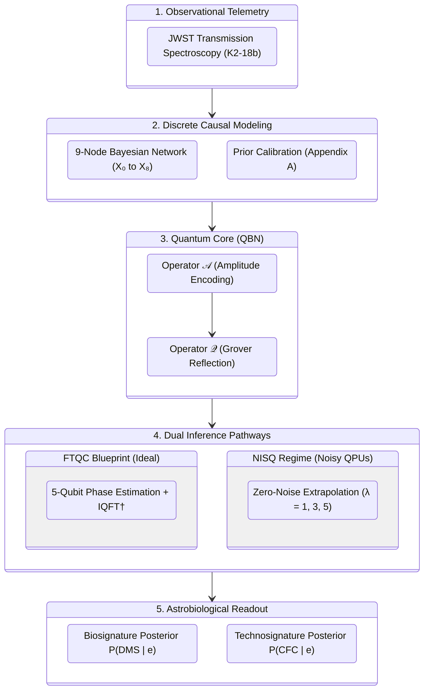

<div align="center">

# Quantum Bayesian Inference for Atmospheric Biosignature and Technosignature Characterization in Exoplanetary Systems

**Master's Thesis in Quantum Computing (Academic Year 2025/2026)**  
**Escuela Politécnica Superior — Universidad Antonio de Nebrija**

[](https://github.com/danielriverolosa/quantum-bayesian-inference-astrobiology/actions/workflows/compile_and_release_thesis.yml)
[-blue?style=flat-square&logo=github)](https://github.com/danielriverolosa/quantum-bayesian-inference-astrobiology/releases/tag/latest)
[](https://www.gnu.org/licenses/gpl-3.0)

<p align="center">
  <a href="https://github.com/danielriverolosa/quantum-bayesian-inference-astrobiology/releases/download/latest/Quantum_Bayesian_Inference_Thesis_Digital.pdf">
    
  </a>
  &nbsp;&nbsp;
  <a href="https://github.com/danielriverolosa/quantum-bayesian-inference-astrobiology/releases/download/latest/Quantum_Bayesian_Inference_Thesis_Print.pdf">
    
  </a>
  &nbsp;&nbsp;
  <a href="https://github.com/danielriverolosa/quantum-bayesian-inference-astrobiology/releases/download/latest/Quantum_Bayesian_Inference_Thesis_Cover.pdf">
    
  </a>
</p>

[](https://www.python.org/)
[](https://qiskit.org/)
[](https://mitiq.readthedocs.io/)
[](https://pgmpy.org/)
[](https://www.latex-project.org/)

<br/>

**Author:** [Daniel Rivero Losa](https://github.com/danielriverolosa) &nbsp;|&nbsp; **Supervisor:** Roberto Campos Ortiz  
**Benchmark Target:** Exoplanet K2-18b (JWST Transmission Spectroscopy)

</div>

---

## 🌌 Executive Abstract

Next-generation space observatories—chiefly the **James Webb Space Telescope (JWST)** and the future **Habitable Worlds Observatory (HWO)**—produce rich, coupled transmission telemetry of exoplanetary atmospheres. Evaluating the causal likelihood of candidate biosignatures (e.g., DMS) and ultra-rare technosignatures (e.g., CFCs at $p \approx 10^{-6}$) using classical probabilistic graphical models encounters insurmountable computational bottlenecks:

1. **Exact Inference:** Clique trees (Junction Tree) suffer an exponential memory ceiling $\mathcal{O}(N \cdot d^{w+1})$ driven by high network treewidth $w$.
2. **Stochastic Sampling:** Markov Chain Monte Carlo (MCMC) and Rejection Sampling are constrained to $\mathcal{O}(1/\sqrt{M})$, succumbing to **L'Ecuyer's variance divergence** ($\mathrm{RE} \to \infty$) and Kac's recurrence trap ($\mathbb{E}[\tau] \approx 10^6$ steps).

This work establishes an end-to-end **Quantum Bayesian Network (QBN)** architecture coupled with **Quantum Amplitude Estimation (QAE)** in Qiskit to overcome both boundaries with bounded in-degree state preparation $\mathcal{O}(N \cdot 2^{k_{\max}})$:

<div align="center">



</div>

---

## ⚖️ Tripartite Benchmark: Classical vs. FTQC vs. NISQ

| Feature / Metric | Classical Baseline (pgmpy / MCMC) | Canonical QAE (Fault-Tolerant Horizon) | Error-Mitigated NISQ (Physical Viability) |
| :--- | :--- | :--- | :--- |
| **Spatial Scaling** | $\mathcal{O}(N \cdot d^{w+1})$ RAM explosion in clique potentials. | **$\mathcal{O}(N)$ Qubits:** 9 qubits encode all $2^9 = 512$ states. | **5 physical qubits** encode core inference kernel. |
| **Query Scaling** | $\mathcal{O}(1/\sqrt{M})$ Monte Carlo rate; diverges on rare states. | **$\mathcal{O}(1/M)$ Heisenberg speedup** via Grover rotation. | $\mathcal{O}(1)$ queries with noise-scaled folding factors. |
| **Rare Technosignatures** | **0 detections** in $100{,}000$ MCMC steps; $90.42\%$ rejection. | **Deterministic phase extraction** via Fourier centroid. | Controlled expectation with noise-floor tracking. |
| **Physical Hardware** | Exact math on CPU / RAM. | Master circuit: **$43{,}874$ depth, $44{,}853$ gates** (FTQC). | Kernel: **Depth $D = 39$, $57$ native gates** ($86.44\%$ error mitigation). |
| **Reference Section** | [Chapter 2](thesis/chapters/2.classical_limits.tex) & [Notebook 01](src/chapter_2_classical/01_Classical_Limits_K218b.ipynb) | [Chapter 3](thesis/chapters/3.quantum_bayesian_formalism.tex) & [Notebook 02](src/chapter_4_quantum/02_QAE_Ideal_Simulation.ipynb) | [Chapter 4](thesis/chapters/4.system_architecture.tex) & [Notebook 03](src/chapter_4_quantum/03_NISQ_ZNE_Mitigation.ipynb) |

---

## 🧭 Project Navigation & Deep Dives

Explore dedicated components across the repository:

| Section | Description | Key Deliverables |
| :--- | :--- | :--- |
| 📓 **[Interactive Notebooks](src/)** | Executed Jupyter pipelines for classical stress tests, ideal QAE, and ZNE. | [`01_Classical_Limits`](src/chapter_2_classical/01_Classical_Limits_K218b.ipynb) &bull; [`02_QAE_Ideal`](src/chapter_4_quantum/02_QAE_Ideal_Simulation.ipynb) &bull; [`03_NISQ_ZNE`](src/chapter_4_quantum/03_NISQ_ZNE_Mitigation.ipynb) |
| 📊 **[Data & Priors](data/)** | Structured exoplanetary priors, JWST transmission spectra, and benchmark logs. | [`k218b_cpt_priors.json`](data/k218b_cpt_priors.json) &bull; [`transmission_spectrum.csv`](data/k218b_jwst_transmission_spectrum.csv) &bull; [`data/README.md`](data/README.md) |
| 📚 **[Scientific Library](papers/)** | Archival repository containing 21 peer-reviewed open-access PDFs with DOIs. | Quantum Algorithms &bull; Error Mitigation &bull; Classical Complexity &bull; [`papers/README.md`](papers/README.md) |
| 📑 **[Thesis LaTeX Source](thesis/)** | Full academic monograph source code for print, digital, and Overleaf editions. | Crown Quarto (`main.tex`) &bull; Digital A4 (`main_digital.tex`) &bull; Overleaf (`main_overleaf.tex`) |
| 🎯 **[Conclusions & Horizons](thesis/chapters/5.conclusions.tex)** | Comprehensive synthesis, NISQ-to-FTQC roadmap, and HWO telescope prospects. | Iterative QAE (IQAE without QFT) &bull; PEC mitigation &bull; Multi-planetary scaling |
| 📋 **[Appendix A (CPTs)](thesis/chapters/6.appendix_cpts.tex)** | Exhaustive combinatorial CPTs ($2^k$ rows), analytical marginals, and derivations. | Prior $P(X_3) = 0.0763$, $P(X_8) = 10^{-6}$, JWST posterior $P(\mathbf{e}) = 0.095804$ |
| 🛠️ **[Appendix B (Transpilation)](thesis/chapters/7.appendix_transpilation.tex)** | 100% verified Qiskit transpiler metrics, gate inventories, and CNOT scaling. | 17Q Master Profile ($44{,}853$ ops) &bull; ZNE CNOT linearity ($23 \to 69 \to 115$) &bull; $n_E \in [3, 10]$ scaling |

---

## 🚀 Quickstart & Reproduction

```bash
# 1. Clone the repository and set up environment
git clone https://github.com/danielriverolosa/quantum-bayesian-inference-astrobiology.git
cd quantum-bayesian-inference-astrobiology
python3.11 -m venv .venv && source .venv/bin/activate
pip install -r requirements.txt

# 2. Run classical baseline (Junction Tree & MCMC)
python src/chapter_2_classical/build_and_run_01_classical.py

# 3. Run quantum simulations (Ideal QAE & NISQ ZNE)
python src/chapter_4_quantum/build_and_run_02_qae_ideal.py
python src/chapter_4_quantum/build_and_run_03_nisq_zne.py
```

---

## 📜 Academic Citation

```bibtex
@mastersthesis{riverolosa2026quantum,
  author       = {Daniel Rivero Losa},
  title        = {Quantum Bayesian Inference for Atmospheric Biosignature and Technosignature Characterization in Exoplanetary Systems},
  school       = {Escuela Politécnica Superior, Universidad Antonio de Nebrija},
  year         = {2026},
  month        = {February},
  type         = {Master's Thesis},
  address      = {Madrid, Spain},
  note         = {Supervisor: Roberto Campos Ortiz},
  url          = {https://github.com/danielriverolosa/quantum-bayesian-inference-astrobiology}
}
```

---

## ⚖️ License

Code released under the **GNU General Public License v3.0 (GPLv3)**. Thesis manuscript and figures are published under academic research fair use.
